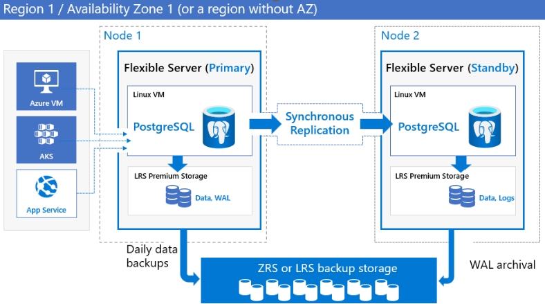
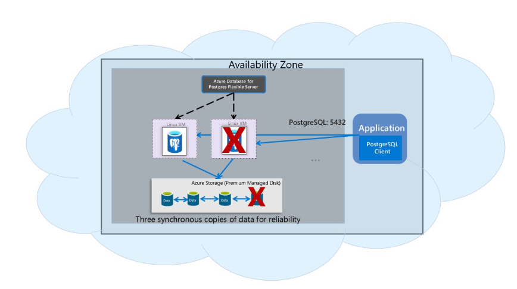
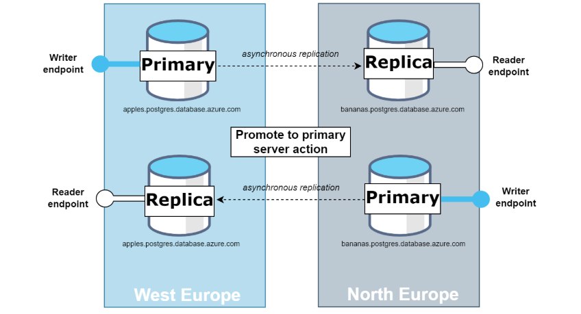
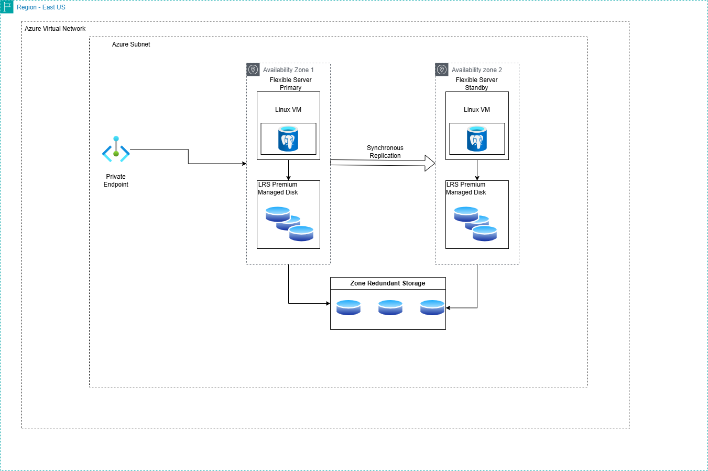
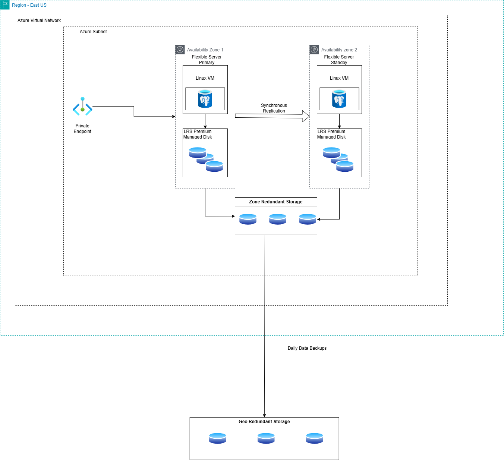
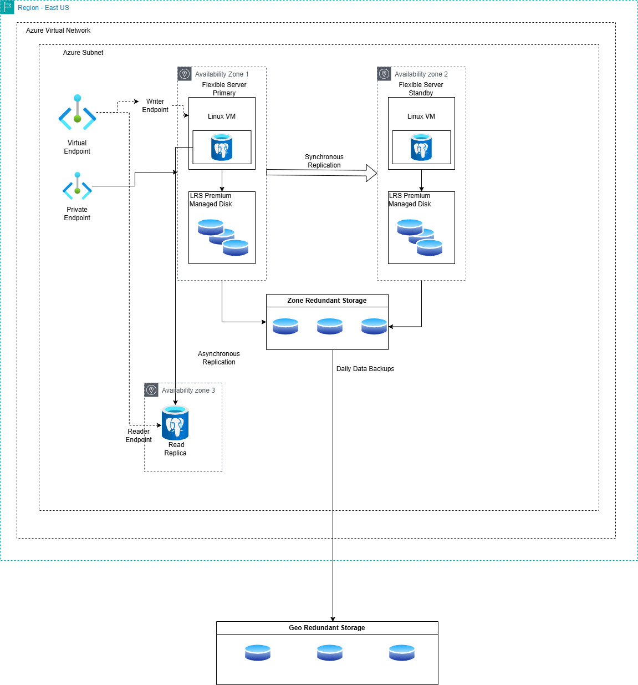
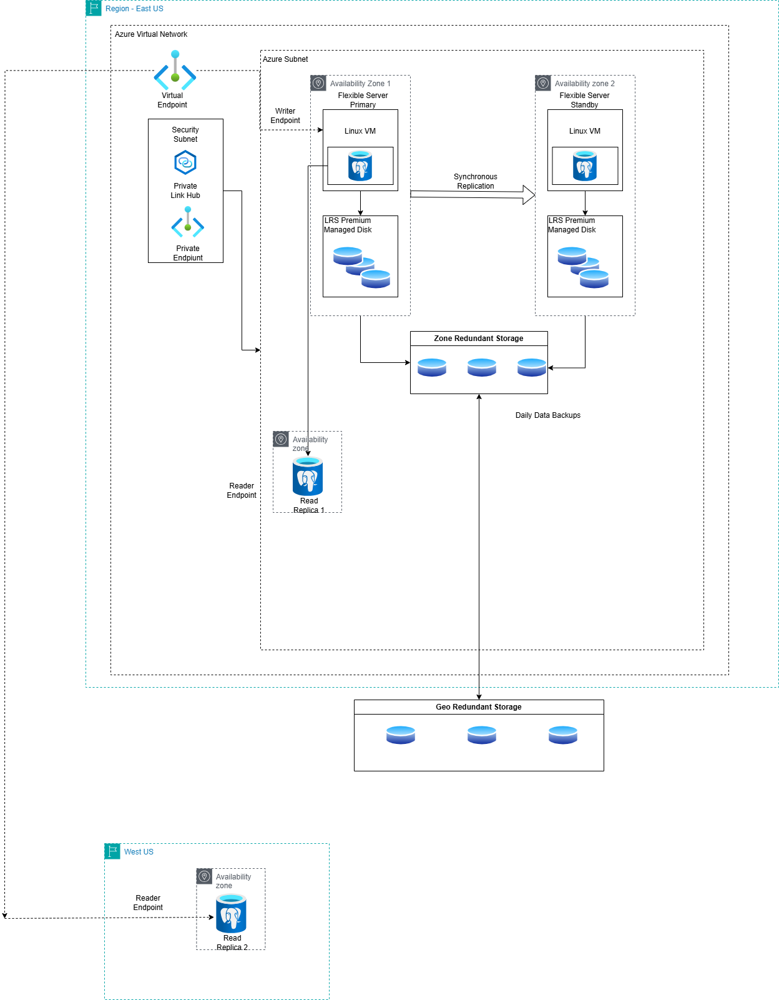

# Azure Database for PostgreSQL Resiliency Solution Accelerator

# Introduction
We are excited to launch the solution accelerator for deploying Azure Database for PostgreSQL flexible server's resiliency architecture. The architecture is designed to protect data and minimize downtime for mission-critical databases during both planned and unplanned events. This guide includes Terraform scripts to deploy these architectures quickly and efficiently.

# Table of Content
* [Business Continuity Features](#business-continuity-features)
* [Recommended actions to achieve resiliency](#recommended-actions-to-achieve-resiliency)
* [Reference Architectures](#reference-architectures)
* [Deploy Terraform scripts](#deploy-terraform-scripts)
 

# Business Continuity Features
Azure Database for PostgreSQL flexible server is built on a resilient Azure infrastructure, incorporating features essential for ensuring high availability and fault tolerance, ensuring your databases remain operational. When architecting applications, it is critical to consider the following objectives:

#### 1. Recovery Time Objective (RTO)
RTO is the maximum acceptable downtime for an application. Different applications have varying tolerance levels for instance, a business-critical database demands much stricter uptime compared to a test database.

#### 2. Recovery Point Objective (RPO)
RPO refers to the maximum acceptable amount of data loss measured in time. Assessing how much data loss your business can tolerate in the event of a disruption is vital.

### Read Replicas
Read replicas enhance performance and availability by creating copies of the primary server either in the same region or across different Azure regions. In-region replicas can improve read performance, while cross-region replicas protect against regional failures using PostgreSQL's physical replication technology. 

### High-Availability
Azure Database for PostgreSQL flexible Server supports both zone-redundant and zonal models for high-availability configurations, providing automatic failover capabilities without any data loss during planned or unplanned events.

- **Zone-Redundant:** Zone-redundant high availability deploys a standby replica in a different availability zone, enabling automatic failover to maintain service continuity. This configuration delivers the highest level of availability and requires configuring application redundancy across zones. Choose zone redundancy when you require robust protection against availability zone failures and when you can tolerate the associated latency between zones. The zone-redundancy model offers an uptime Service Level Agreement (SLA) of 99.99%.

- **Zonal:** Choose a zonal deployment when you want to achieve the highest level of availability within a single availability zone, but with the lowest network latency. Zonal model offers uptime SLA of 99.95%.

   
  
In both zone-redundant and zonal models, automatic backups are periodically performed from the primary database server, while transaction logs are continuously archived from the standby replica. If the region supports availability zones, backup data will be stored on zone-redundant storage (ZRS). In regions without availability zone support, backup data is stored on local redundant storage (LRS)

### Backup and restore 
Backups form an essential part of any business continuity strategy. They help protect data from accidental corruption or deletion. Azure Database for PostgreSQL flexible Server takes snapshot backups of data files and stores them securely in zone-redundant storage or locally redundant storage, depending on the region. The server also backs up transaction logs when the write-ahead log (WAL) file is ready to be archived. You can use these backups to restore a server to any point in time within your configured backup retention period.


For  servers configured without high availability, the service provides local redundant storage with three copies of data, zone-redundant backup (in regions where it's supported), and built-in server resiliency to automatically restart a crashed server and relocate the server to another physical node. In case if a zone is down, we can perform Point-in-time restore to create a new server with the recovered backup data. Uptime SLA of 99.9% is offered in this configuration.



Geo-redundant backup storage: You can choose this option at the time of server creation. When the backups are stored in geo-redundant backup storage, in addition to three copies of data stored within the region where your server is hosted, the data is replicated to a geo-paired region. Geo-redundancy is supported for servers hosted in any of the [Azure paired regions](azure/reliability/regions-paired).

# Recommended actions to achieve resiliency

### Regional Outage Protection
Azure protects your data against regional outages, ensuring continuity during unforeseen events like disasters. In case of a widespread event, Azure's robust disaster recovery mechanisms can fallback to an alternate region, ensuring reliability.



  **Scenario** \
  In the event of a regional failure, you would need to manually promote a read replica in another region to be the new primary server. This process involves changing the read replica's role, which then takes over handling the write operations as the new primary server.
  
  **Recommended Actions** 
 1.  Deploy instances across multiple Azure regions.
 2.  Set up cross-region replication for disaster recovery.
 3.  Implement geo-redundant configurations.
 4.  Ensure automated backups with configurable retention periods.
 5.  Create Virtual Endpoints. These are read-write and read-only listener endpoints, that remain consistent irrespective of the current role of the Azure Database for PostgreSQL flexible server instance
    a. Using Virtual EndPoint with Read Replica:
        The read-only endpoint will point to the new replica which was the former primary 
    b. Use Virtual EndPoint in Parity with Read Replica to failover and failback between replicas
6.  With geo-redundant backup, you can perform a geo-restore in the paired region during an outage, creating a new server with the last available data. Cross-region read replicas can also be promoted to standalone read-write servers during regional failures, with an RPO of up to 5 minutes.
   
 **Impact** \
  In Azure Database for PostgreSQL flexible server, when you make changes to keys or permissions on the primary server, these changes are typically replicated to any read replicas automatically. This replication includes changes to roles, permissions, and other security settings. Read replicas typically provide near-real-time updates from the primary server, but heavy, persistent write activities can lead to increased replication lag and higher storage usage on the primary due to retained WAL files

### Zonal Protection
Zonal protection: We offer an option to host your standby instance in a different zone than the primary instance. You can select this option from the availability zone section on the portal and choose from zones [1, 2, 3]. This ensures that your instance is protected in case of a complete zonal outage. For example, if you select availability zone 1 for the primary instance, the standby instance can be chosen from either zone 2 or 3. Once you make this selection, the WAL server will be created in a zone that is different from both the primary and standby instances.

  **Scenario:**  
  In case of Zonal outage when its Planned like scale computing and scale storage happen on the standby first and then on the primary server. Currently, the server doesn't failover for these planned operations. In case of unplanned failover the standby becomes the new primary and then it creates a new standby in a different zone.
  
  **Recommended Actions:**  
 1.  Configure HA with Zone redundant option and select the zone for Primary and Standby.
 2.  Flexible server health monitoring periodically checks for both the primary and standby health. If health monitoring detects that a primary server isn't reachable, the service then initiates an automatic failover to the standby server. 
 3.  Point-in-restore is recommended for user errors on the primary server like accidental drop of a table or incorrect data updates, from the backup. A new database server is restored as a single-zone flexible server with a new user-provided server name. Possible use cases could be:
    a. Use restored server for production
    b. Restore an object 
    c. Clone your database server to testing and development 
4. Implement monitoring and alerts to ensure timely detection and response. 
5. Use Private Link for secure and seamless failover.
     
**Impact:**  
  In Azure Database for PostgreSQL flexible server, when you make changes to keys or permissions on the primary server, these changes are typically replicated to any read replicas automatically. This replication includes changes to roles, permissions, and other security settings. Read replicas typically provide near-real-time updates from the primary server, but heavy, persistent write activities can lead to increased replication lag and higher storage usage on the primary due to retained WAL files

> Note: In the event of a zonal outage where an entire zone goes down due to unforeseen circumstances, the standby instance created in a different zone will become the primary instance. However, it is not possible to create a new standby server until the affected zone is restored.

# Reference Architectures
In this architecture we recommend using Private endpoint for the Azure Database for PostgreSQL instance. A private endpoint adds a network interface to a resource, providing it with a private IP address assigned from your virtual network. After it's applied, you can communicate with this resource exclusively via the virtual network. Please read more about [benefits of using Private link](https://learn.microsoft.com/en-us/azure/postgresql/flexible-server/concepts-networking-private-link). 
Three variants exist in the Azure Database for PostgreSQL resiliency architecture:

### 1. Zonal resilience (without read replica)
This architecture provisions Azure Database for PostgreSQL flexible server with high availability enabled using the "Zone-Redundant" option. The primary and standby instances are deployed in different availability zones, ensuring resilience against zonal failures. With this configuration, you achieve a Recovery Point Objective (RPO) of zero and a Recovery Time Objective (RTO) of less than 120 seconds. Zone-redundant high availability provides automatic failover, robust protection from zonal outages, and high service-level agreements (SLAs), making it an ideal choice for mission-critical workloads.

**Zone resilient:** Deploying a standby instance in a different availability zone ensures high availability and protection against zonal failures. This configuration also maintains three copies of your data within the region, providing additional redundancy and data durability.



**Zone resilience with geo-redundant backups:** Deploying a standby instance in a different availability zone and enabling geo-redundant backups provides robust protection against both zonal and regional failures. Geo-redundant backups, configured during flexible server creation, ensure data is securely replicated to a paired region. This configuration strengthens disaster recovery capabilities and supports business continuity during major outages.



### 2. Zonal resilience (with read replica)
This configuration deploys a flexible server instance with High Availability enabled using the "ZoneRedundant" option, geo-redundant backups, and a read replica in the same region as the primary. This setup provides protection against zonal outages and supports scaling out read-heavy workloads by directing read traffic to the replica through virtual endpoints.



### 3. Regional resilience
This architecture deploys a flexible server instance with High Availability enabled using the "ZoneRedundant" option and geo-redundant backups configured at server creation. It provisions one read replica in the same region as the primary server but in a different zone, along with another read replica in a different region. This setup ensures protection against both zonal and regional outages. The cross-region read replica supports a robust disaster recovery strategy, maintaining a Recovery Point Objective (RPO) of less than 5 minutes. In the event of a regional failover, the cross-region read replica can be promoted to serve as the new primary instance, enabling applications to remain operational with minimal downtime. This architecture offers the highest level of resiliency, covering all failure scenarios from zonal to regional outages, making it well suited for mission-critical workloads.



# Deploy terraform scripts
You can use Terraform scripts to deploy these architectures.

To deploy this solution using Terraform, follow these steps:
> Note: If you want to use your existing resource group, remove the resource group block from the "main.tf" file. We have added this block assuming you dont have a resource group created. In the "variables.tf" file edit all the variable names and save the file. 

### Prerequisites
- An Azure account.
- Azure CLI installed on your local terminal.
- Terraform installed.

### Deployment steps

1. **Open your terminal in which you have Azure CLI installed**: For this solution accelerator, we are utilizing Azure Cloud Shell. You can launch the Azure portal and access the Cloud Shell, or alternatively, use a local terminal with Azure CLI installed.

2. **Set account subscription**

   Set your Azure subscription using the following command:
   ```sh
   az account set --subscription <subscription-name>
   ```
3.  **Upload Terraform files**: Upload the necessary Terraform files. This step is only necessary if you're using Azure Cloud Shell or some other remote terminal.

### Execute Different Versions of Terraform Files:

   - **Zonal Resilience (Without read replica)**:

      This has a script that deploys Azure PostgreSQL flexible server instance with high avaliability enabled. Edit the "variables.tf" file with your subscription-id, desired names, version and etc. for all the resources.

   - **Zonal Resilience (With read replica)**:

     Modify the variables in the two provided files: "variables.tf" and "main.tf". On "variables.tf" please add values to different attributes; on the second file "main.tf", find all the modules and resources that are deployed with one read replicas in the same region as that of the primary instance.
   
  - **Regional Resilience**:
   
    Similar to the above, edit the necessary files to reflect your configuration. On "variables.tf" please add values to different attributes; on the second file "main.tf"find all the modules and resources that are deployed with one read replica in the same region as that of the primary instance and the another read replica in a different region as that of Primary instance.

### Running the Terraform Script:    

Navigate to the Terraform scripts folder, where you'll find separate folders for each of the three architectures. Enter the appropriate folder and follow the steps outlined below.

1. **Initialize Terraform**: 

   Initialize your Terraform configuration. This will download the necessary provider plugins:
   ```sh
   terraform init -upgrade
   ```
2. **Create an Execution Plan**: 

    Generate and save an execution plan to review the changes Terraform will make:
    ```sh
   terraform plan -out <file-name>
   ```
3. **Apply the Plan**: 
   This command will apply the generated terraform plan:
   ```sh
    terraform apply <file-name>.tfplan
