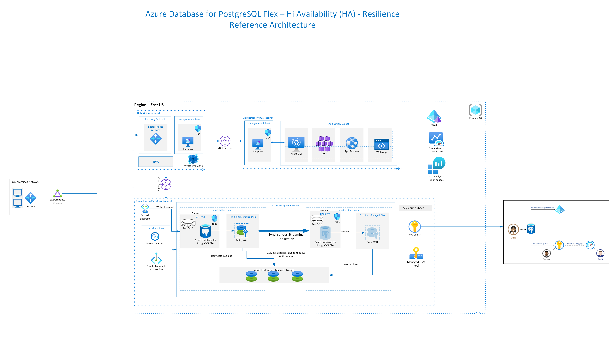
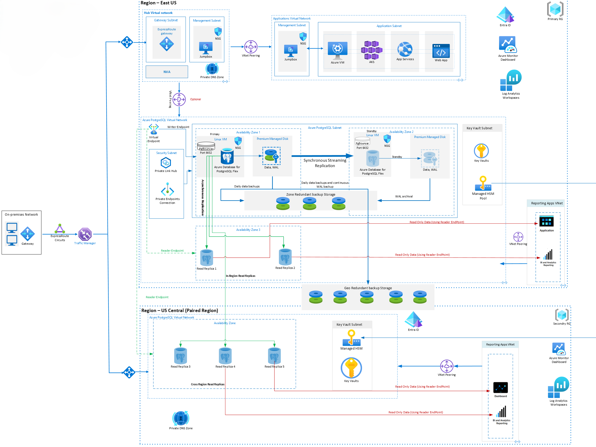

# Azure-PostgreSQL-Resilience-Architecture - Terraform

Azure PostgreSQL Flexible server resilience architecture provides you with the capability to protect data and minimize downtime for mission-critical databases during both planned and unplanned events. There are 3 variants in this architecture

1. **Zonal Resilience - without Read Replica**:
   
   This has one primary instance of Azure PostgreSQL Flexible server instance and is enabled with High Availability. In this configuration when we enable high availability for this instance we can deploy the standby 
   instance with two options by changing the "mode" attribute. There are two values for this attribute:
   
   a. **ZoneRedundant** - Deploying standby in different zone
   
   b. **SameZone** - Deploying standby instance in the same zone as that of primary

   
   
2. **Zonal Resilience - with Read Replica** :
   
    This configuration has one instance of Azure PostgreSQL Flexible Server and two read replicas in same region as that of primary instance. In this type we can configure the "zone" attribute which is specifies the value 
    for Availability zone like we have in the portal. We have 3 Availability zones in Azure PostgreSQL Flexible Server. The value added here depends on what is the value added for the Primary instance
   


3.  **Regional Resilience** :

   Azure PostgreSQL supports deployment of 5 read replicas in any region. In this type of configuration we have 2 read replicas in the same region as that of primary and three read replicas are deployed in a different 
   region to that of the primary server. 


## Prerequisites

- Azure account
- Azure CLI installed
- Terraform installed

## Steps to execute the terraform script

1. **Go to Azure portal and launch the CLI**

   Open the Azure portal and launch the Cloud Shell or use your local terminal with Azure CLI installed. On the Azure Cli upload all the terraform files.

2. **Set account subscription**

   Set your Azure subscription using the following command:
   ```sh
   az account set --subscription <subscription-name>
   ```
3.  **Upload all files**

4. **Execute different versions of terraform file**

   a. **Zonal Resilience - without Read Replica**

      This has a script that will just deploy Azure PostgreSQL Flexible server instance with high avaliability enabled attribute. Edit the "variables.tf" file with your subscription-id, desired names, version etc for all the resources.

   b. **Zonal Resilience - with Read Replica**
      
      This script has 2 files: First file is a variables file, please add values to different attributes in this file.  and second file "main.tf" has all the modules and resources that would be deployed with two read replicas in the same region as that of the Primary instance.
   
   c. **Regional Resilience**

      This script has 2 files: First file is a variables file, please add values to different attributes in this file.  and second file "main.tf" has all the modules and resources that would be deployed with two read replicas in the same region as that of the Primary instance and 3 read replicas in a different region as that of Primary instance.

# Steps to run a terraform file:     

1. **Initialize Terraform**

   Initialize your Terraform configuration. This will download the necessary provider plugins:
   ```sh
   terraform init -upgrade
   ```
2. **Create an execution plan**

    Generate and save an execution plan to review the changes Terraform will make:
    ```sh
   terraform plan -out <file-name>
   ```
3. **Apply the plan**
   This command will apply the generated terraform plan:
   ```sh
    terraform apply <file-name>.tfplan
