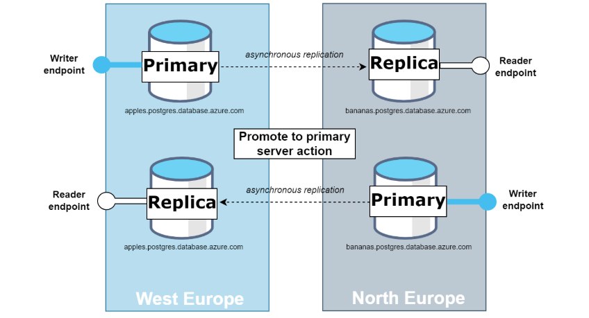
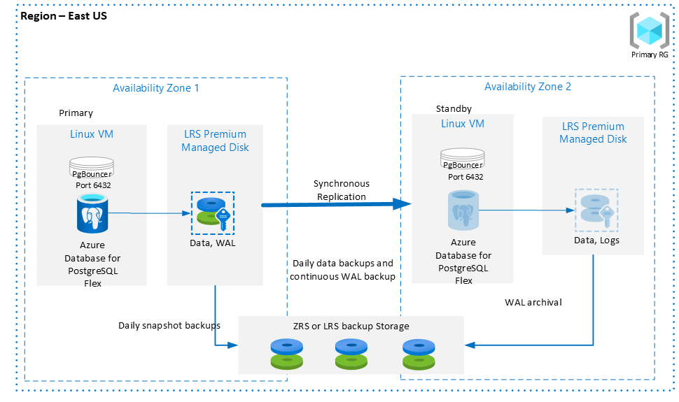
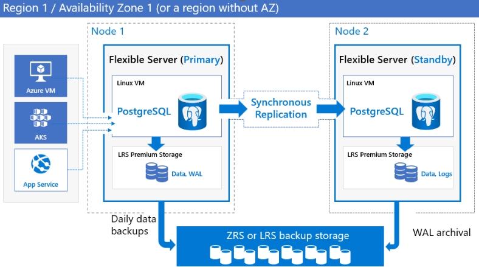
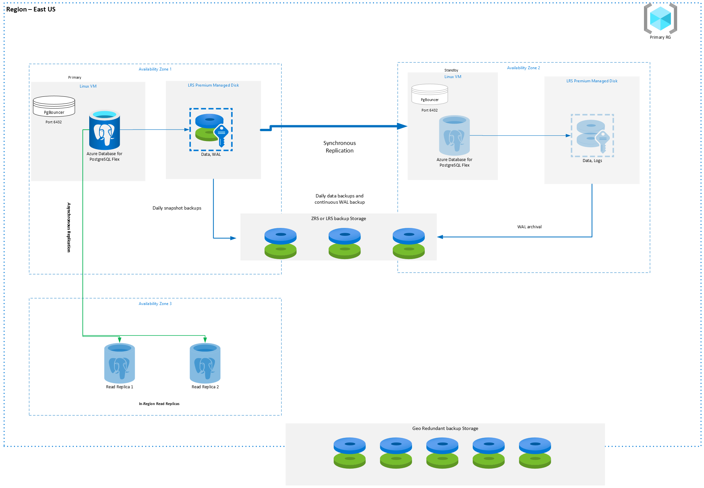
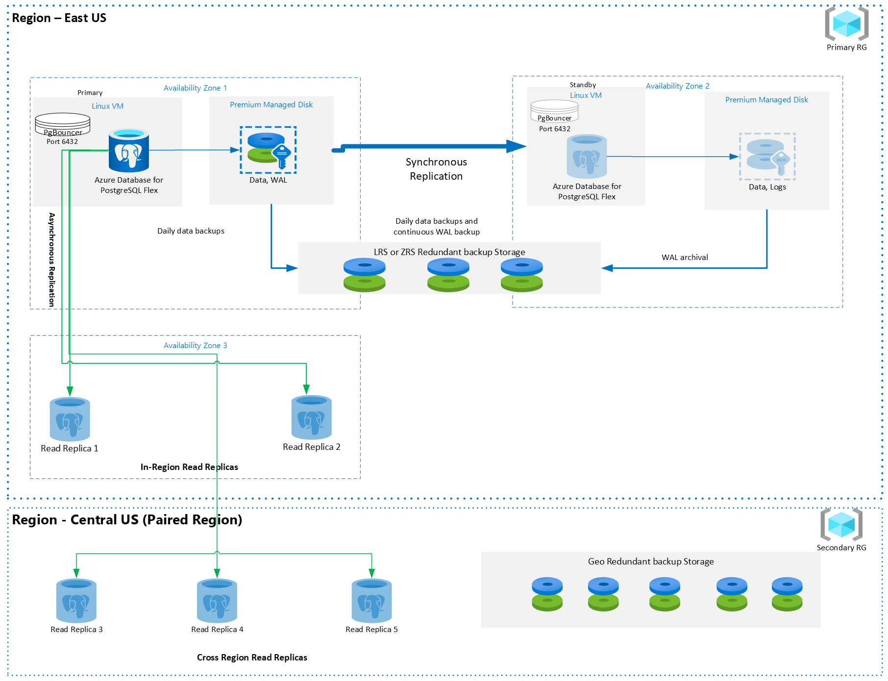

# Azure Database for PostgreSQL Resiliency Solution Accelerator

## Introduction
This solution accelerator aims to guide you in exploring various deployment options with Azure Database for PostgreSQL Flexible Server's resiliency architecture. This architecture is designed to protect data and minimize downtime for mission-critical databases during both planned and unplanned events. This guide includes ARM templates and Terraform scripts to help you deploy these architectures quickly and efficiently.

## Ensuring Business Continuity with Flexible Server
Azure Database for PostgreSQL Flexible Server is built on a resilient Azure infrastructure, incorporating features essential for ensuring high availability and fault tolerance, ensuring your databases remain operational. When architecting applications, it is critical to consider the following objectives:

### 1. Recovery Time Objective (RTO)
RTO is the maximum acceptable downtime for an application. Different applications have varying tolerance levels—for instance, a business-critical database demands much stricter uptime compared to a test database.

### 2. Recovery Point Objective (RPO)
RPO refers to the maximum acceptable amount of data loss measured in time. Assessing how much data loss your business can tolerate in the event of a disruption is vital.

## Core Features of Azure Database for PostgreSQL

### Geo-Redundant Backup and Restore
Geo-redundant backups enable you to restore your server in a different region during a disaster, providing high durability for backup objects. This cost-effective solution requires configuration at server creation and asynchronously copies backup data and transaction logs to a paired region.

### Read Replicas
Read replicas enhance performance and availability by creating copies of the primary server either in the same region or across different Azure regions. In-region replicas can improve read performance, while cross-region replicas protect against regional failures using PostgreSQL's physical replication technology. 



## Resiliency Features in Azure Database for PostgreSQL

### Zonal Outage Protection
Azure Database for PostgreSQL Flexible Server supports both zone-redundant and zonal models for high-availability configurations, providing automatic failover capabilities without any data loss during planned or unplanned events.

- **Zone-Redundant:** Zone-redundant high availability deploys a standby replica in a different availability zone, enabling automatic failover to maintain service continuity. This configuration delivers the highest level of availability and requires configuring application redundancy across zones. 

Choose zone redundancy when you require robust protection against availability zone failures and when you can tolerate the associated latency between zones. The zone-redundancy model offers an uptime Service Level Agreement (SLA) of 99.99%. 

In both zone-redundant and zonal models, automatic backups are periodically performed from the primary database server, while transaction logs are continuously archived from the standby replica. If the region supports availability zones, backup data will be stored on zone-redundant storage (ZRS). In regions without availability zone support, backup data is stored on local redundant storage (LRS)

### Regional Outage Protection
Azure protects your data against regional outages, ensuring continuity during unforeseen events like disasters. In case of a widespread event, Azure's robust disaster recovery mechanisms can fallback to an alternate region, ensuring reliability.

## Reference Architectures
Three variants exist in the Azure Database for PostgreSQL resiliency architecture:

### 1. Zonal Resilience (Without Read Replica)
This configuration includes one primary instance of the Azure PostgreSQL Flexible Server with high availability enabled. In this configuration, enabling high availability for the instance allows us to deploy the standby instance using two options by modifying the "mode" attribute. This attribute can take two possible values:
   
   - **ZoneRedundant:** Deploying standby in different zone. [](https://portal.azure.com/#create/Microsoft.Template/uri/https%3A%2F%2Fraw.githubusercontent.com%2FAzure-Samples%2FAzure-PostgreSQL-Resilience-Architecture%2Frefs%2Fheads%2Fdemotemplate%2Fsetup%2Fpostgresinfra%2Fzoneredundanttemplate.json) 
   
    
   
   - **Same Zone:** Deploying standby instance in the same zone as that of primary [](https://portal.azure.com/#create/Microsoft.Template/uri/https%3A%2F%2Fraw.githubusercontent.com%2FAzure-Samples%2FAzure-PostgreSQL-Resilience-Architecture%2Frefs%2Fheads%2Fdemotemplate%2Fsetup%2Fpostgresinfra%2Fsamezonetemplate.json)

     


### 2. Zonal Resilience (With Read Replica)
This configuration includes one primary instance and two read replicas within the same region. 

  [](https://portal.azure.com/#create/Microsoft.Template/uri/https%3A%2F%2Fraw.githubusercontent.com%2FAzure-Samples%2FAzure-PostgreSQL-Resilience-Architecture%2Frefs%2Fheads%2Fdemotemplate%2Fsetup%2Fpostgresinfra%2Freadreplica.json)
   
    This configuration has one instance of Azure PostgreSQL Flexible Server and two read replicas in same region as that of primary instance. In this type we can configure the "zone" attribute which is specifies the value 
    for Availability zone like we have in the portal. We have 3 Availability zones in Azure PostgreSQL Flexible Server. The value added here depends on what is the value added for the Primary instance
   


### 3. Regional Resilience
This architecture supports one primary instance with two read replicas in the same region and three additional read replicas in a different region.
[](https://portal.azure.com/#create/Microsoft.Template/uri/https%3A%2F%2Fraw.githubusercontent.com%2FAzure-Samples%2FAzure-PostgreSQL-Resilience-Architecture%2Frefs%2Fheads%2Fdemotemplate%2Fsetup%2Fpostgresinfra%2Fcrossregionreplica.json)

   Azure PostgreSQL supports deployment of 5 read replicas in any region. In this type of configuration we have 2 read replicas in the same region as that of primary and three read replicas are deployed in a different 
   region to that of the primary server. 



## Terraform Deployment Instructions
To deploy this solution using Terraform, follow these steps:

### Prerequisites:
- An Azure account
- Azure CLI installed
- Terraform installed

### Deployment Steps:

1. **Open Azure CLI**: Launch the Azure portal and access the Cloud Shell or use a local terminal with the Azure CLI installed.

2. **Set Account Subscription**: 

   Set your Azure subscription using the following command:
   ```sh
   az account set --subscription <subscription-name>
   ```
3.  **Upload Terraform Files**: Upload the necessary Terraform files.

### Execute Different Versions of Terraform Files:

   - For **Zonal Resilience (Without Read Replica)**:

      This has a script that deploys Azure PostgreSQL Flexible server instance with high avaliability enabled. Edit the "variables.tf" file with your subscription-id, desired names, version and etc. for all the resources.

   - For **Zonal Resilience (With Read Replica)**:

     Modify the variables in the two provided files: "variables.tf" and "main.tf". On "variables.tf" please add values to different attributes; on the second file "main.tf", find all the modules and resources that are deployed with two read replicas in the same region as that of the primary instance.
   
  - For **Regional Resilience**:
   
    Similar to the above, edit the necessary files to reflect your configuration
    On "variables.tf" please add values to different attributes; on the second file "main.tf"find all the modules and resources that are deployed with two read replicas in the same region as that of the primary instance and the 3 read replicas in a different region as that of Primary instance.

### Running the Terraform Script:    

1. **Initialize Terraform**: 

   Initialize your Terraform configuration. This will download the necessary provider plugins:
   ```sh
   terraform init -upgrade
   ```
2. **Create an Execution Plan**: 

    Generate and save an execution plan to review the changes Terraform will make:
    ```sh
   terraform plan -out <file-name>
   ```
3. **Apply the Plan**: 
   This command will apply the generated terraform plan:
   ```sh
    terraform apply <file-name>.tfplan
